<p align="center">
  
</p>

<p align="center">
  Text, voice and video chat for a group of friends or a small community, running on a computer you own.
</p>

<p align="center">
  <a href="../../releases/latest"></a>
  
  <a href="LICENSE"></a>
</p>

<p align="center">
  <a href="../../releases/latest">Download</a> ·
  <a href="#getting-started">Getting started</a> ·
  <a href="#a-look-around">A look around</a> ·
  <a href="#whats-in-it">What's in it</a> ·
  <a href="#running-it">Running it</a> ·
  <a href="#development">Development</a> ·
  <a href="docs/getting-started.md">Docs</a>
</p>

<p align="center">
  Current release: <strong>v3.2.0</strong> — <a href="RELEASE_NOTES.md">what changed</a>
</p>

---

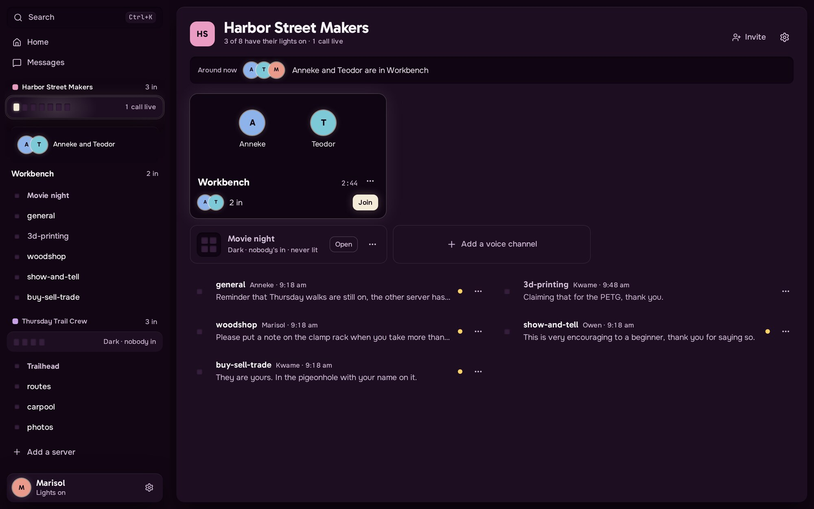

Paracord works about how you'd expect from Discord: servers, text and voice channels,
direct messages, roles, moderation. The difference is that there's no company in the
middle. Somebody in your group runs the Paracord server on a computer that stays on, and
everyone else joins with a link.

Setting that up is one command. It downloads Paracord, sets it to start by itself, asks
your router to let people in, and opens a link in your browser where you make your account
and name your server. Friends open an invite link in any browser, or install the desktop
app for Windows, Linux or macOS.

Direct messages and group messages are encrypted end to end. Voice and video run on
Paracord's own code, so there's no third-party media service to sign up for.

It suits a group that has somebody willing to keep a machine on and read a docs page when
something breaks. Nobody is hosting this for you, and it's a young project, so the
[things that don't work yet](#good-to-know) are worth reading before you move a community
onto it.

## Getting started

### Somebody sent you an invite link

Open it in any browser, press **Create an account to join**, pick a name and a password.
That's the whole thing.

<p align="center">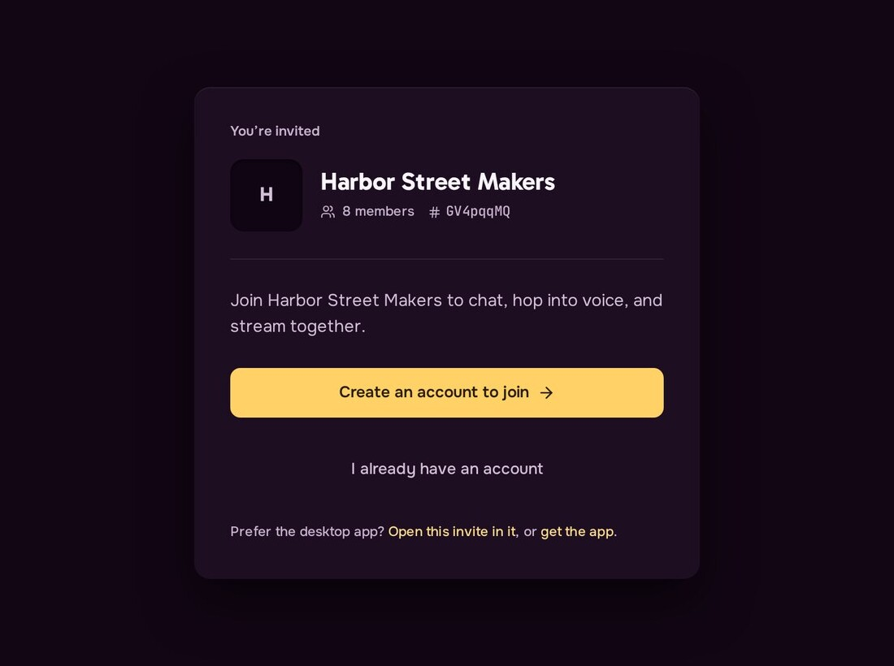</p>

If you'd rather have the app, get it from [Releases](../../releases/latest), open it, and
paste the same link in.

### Running your own server

One command, then one link.

**Linux or macOS**, in a terminal:

```bash
curl -fsSL https://raw.githubusercontent.com/Scdouglas1999/Paracord/main/scripts/install.sh | sh
```

**Windows**, in any PowerShell window (it asks for administrator permission itself):

```powershell
irm https://raw.githubusercontent.com/Scdouglas1999/Paracord/main/scripts/install.ps1 | iex
```

**1. Finish setting up.** The installer opens a link in your browser, and prints it as well.
Choose your name and password, name your server, done. That link works once and only for
you, so nobody who finds your server first can take it over. Your browser shows a one-time
security warning on the way in, because the server made its own certificate: choose
Advanced, then Continue. The desktop app never shows this.

<p align="center">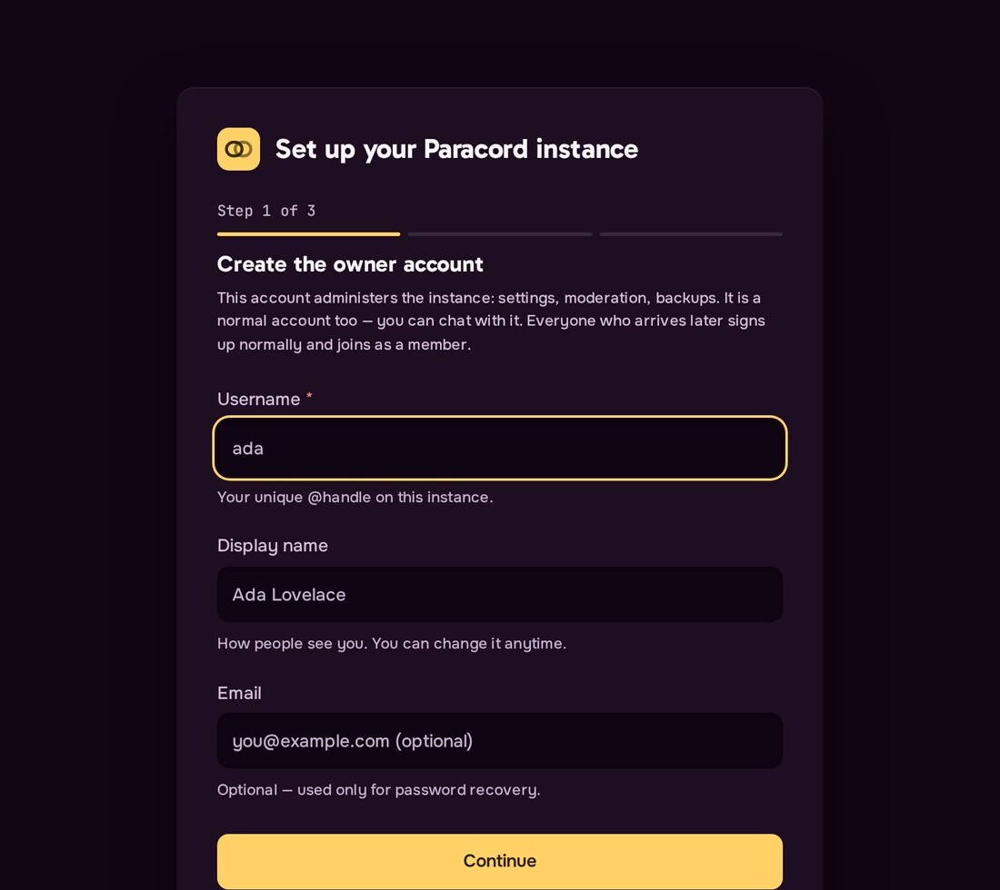</p>

**2. Invite people.** Open your server and press **Invite**. You get a link to
send, and it tells you plainly whether the link will work for anyone or only for people on
your Wi-Fi.

<p align="center">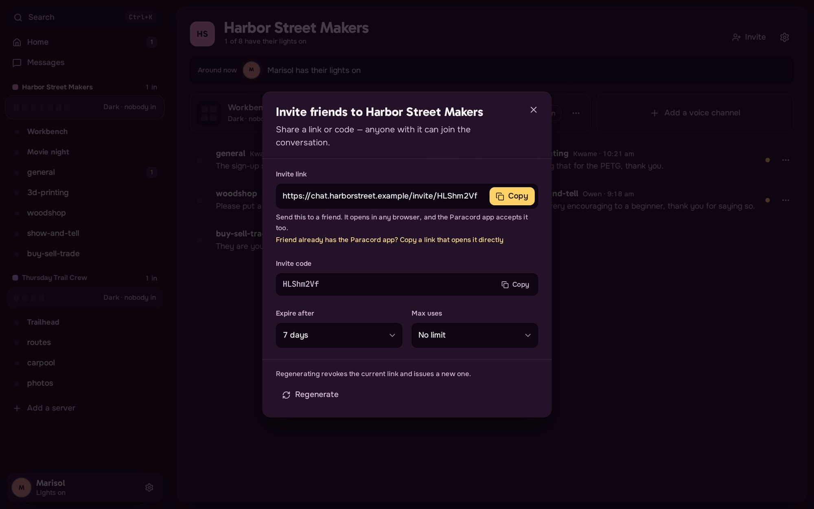</p>

The server asks your router to let outside traffic through when it starts, and most routers
say yes. If yours refuses, the Invite dialog and the server's startup message both say so,
and [Friends outside your network](docs/port-forwarding.md) walks through the one router
setting to change.

Running the same command again later updates Paracord and keeps all your data.

<details>
<summary>What the installer does, if you want to know before you run it</summary>

On Linux with `sudo` it installs under `/opt/paracord`, creates a `paracord` service user
and an auto-restarting systemd unit. Without root it installs under
`~/.local/share/paracord` with a per-user service. On macOS it installs a launchd job. On
Windows with administrator permission it installs under `%ProgramFiles%\Paracord`,
registers an auto-start task running as `SYSTEM`, and opens the firewall for the app and
voice ports; without it, it installs just for you under `%LOCALAPPDATA%\Paracord`.
Upgrades keep your config and data and back up the old binary. `PARACORD_NO_BROWSER=1`
prints the setup link instead of opening it, and the header of `scripts/install.sh` lists
the other overrides. The server maps its ports on the router with UPnP or NAT-PMP; turn
that off with `auto_port_forward = false` under `[network]`.

Downloads are verified by TLS to the official GitHub releases and nothing else. The
release pipeline does not publish checksums yet, and the installer says so while it runs.

</details>

### Manual download

Take `paracord-server-linux-x64-*.tar.gz`, `paracord-server-windows-x64-*.zip` or
`paracord-server-macos-*.tar.gz` from [Releases](../../releases/latest), extract it, and
run it:

```bash
# Linux and macOS
./paracord-server init   # optional: write the config and print what to do next
./paracord-server
```

```powershell
# Windows
.\paracord-server.exe
```

First run creates its settings file, its database and its own certificate, then prints the
one-time link that finishes setup. The same link is saved next to the config as
`first-owner-claim-link.txt`.

### Docker Compose

```bash
curl -fsSL -o docker-compose.yml https://raw.githubusercontent.com/Scdouglas1999/Paracord/main/docker-compose.yml
PARACORD_PULL_POLICY=missing docker compose up -d
```

That pulls the image CI publishes to GHCR. Leave `PARACORD_PULL_POLICY` off to build the
image locally instead, or point `PARACORD_BUILD_CONTEXT` at
`https://github.com/Scdouglas1999/Paracord.git#main` to build from the remote repository
without cloning it. No `.env` file is needed.

The stack publishes the app on `127.0.0.1:8090` and voice on UDP `8443`, and expects a
reverse proxy to handle HTTPS. Browsers only give a page the microphone, camera and screen
once it is served over HTTPS, so put the proxy in front before you send anyone the address;
[Docker Setup](docs/docker-setup.md) has an example.

For the longer walk through a first run see [Getting Started](docs/getting-started.md); for
a domain name, PostgreSQL and backups see [Deployment](docs/deployment.md).

## A look around

Every picture here is the real app, running on a server with eight friends in it.

**A server's front page.** Walk into a server and see who's in voice, what's coming up,
and what people have been sharing: photos, polls you can vote in right there, new forum
questions, the latest announcement. When it's quiet, the page is still full of what
people made, not a list of empty channels.

| | |
| :--- | :--- |
| 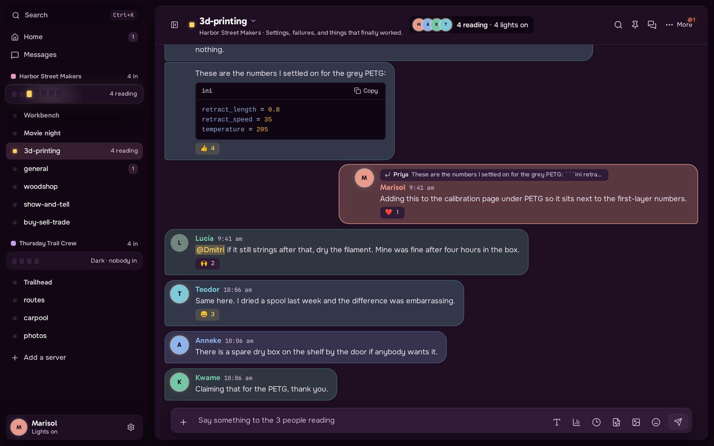 |  |
| Every message wears its author's color. | Home: who's around, your servers, and where you left off. |
| 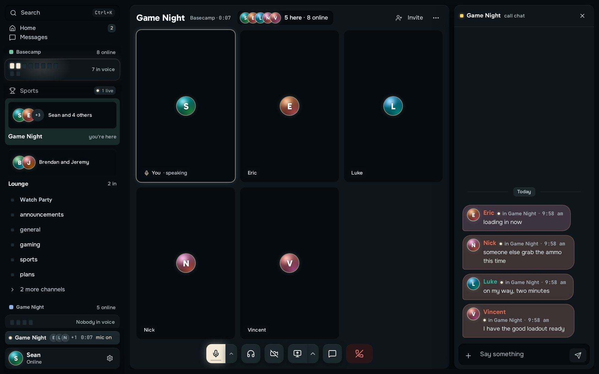 | 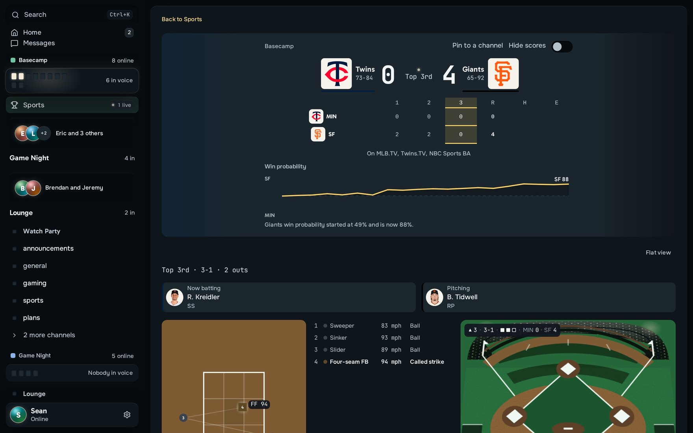 |
| Voice channels with video, screen sharing and a chat of their own. | Sports: follow a game together, live. |

**Search a whole server.** Type `from:`, `in:`, `has:image` or `before:` and they turn into
filters as you go. Results are grouped by channel, and Enter jumps to the message.

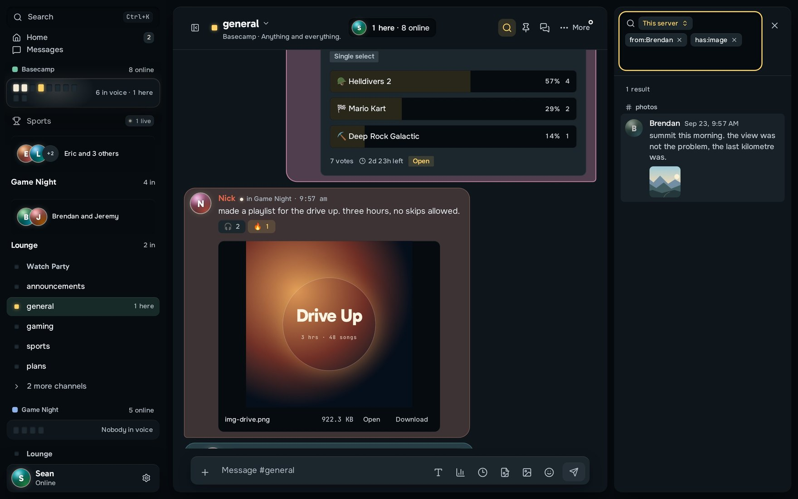

| | |
| :--- | :--- |
| 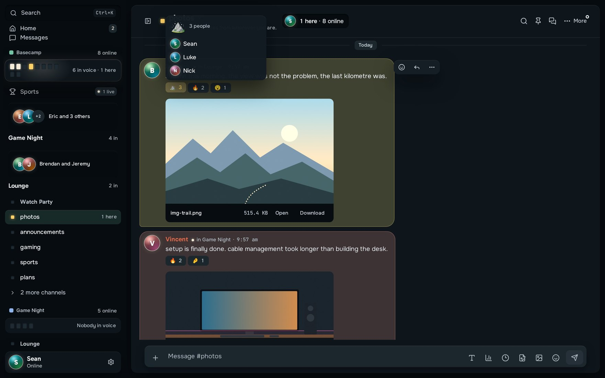 | 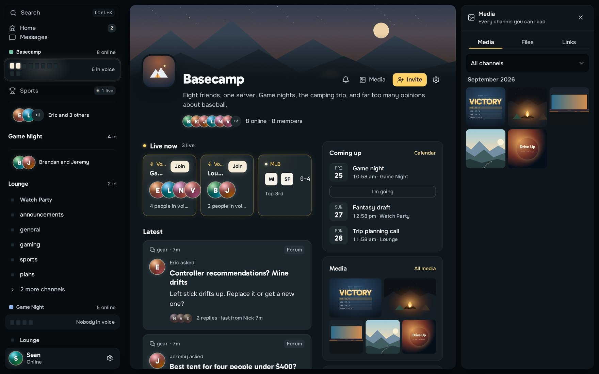 |
| See who reacted, and have Paracord remind you about a message later. | Every photo, file and link a server has shared, in one place. |

It's built for phones too.

<p align="center">
  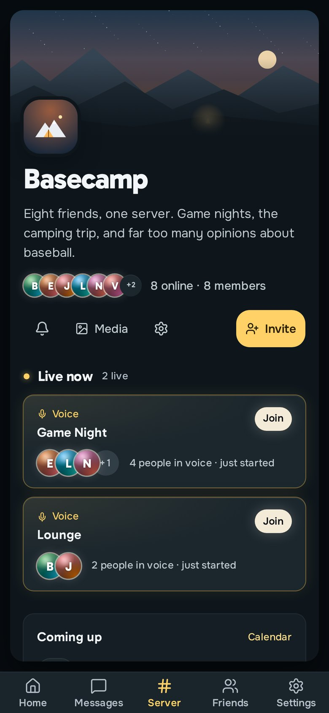 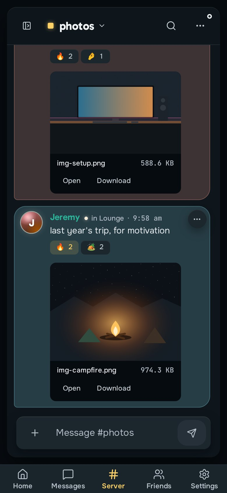
</p>

## What's in it

**Talking.** Text channels, announcement channels, forums and threads. Replies, mentions
(of people and roles), reactions with who reacted, pins, saved messages and reminders.
Forward a message to up to five places with a note. Markdown, syntax-highlighted code,
attachments, image previews and link embeds. Polls, scheduled messages, slash commands,
GIFs, stickers and custom emoji. Search across a whole server with filters, an inbox,
unread counts and per-channel notification settings.

**A front page for every server.** A banner, who's around, what's live, what's coming up,
and a feed of what people shared. Owners choose which panels show and in what order.

**Voice, video and screen sharing.** Voice channels, video grids, screen sharing and device
controls, over Paracord's own QUIC transport: raw QUIC in the desktop app, WebTransport in
the browser. Opus audio with RNNoise noise suppression, VP9 video, speaker detection, and
media frames the relay cannot read.

**Direct messages.** One-to-one and group conversations, encrypted end to end. Text and
attachments are both encrypted on your device, so the server stores files it cannot read and
does not learn their names or types. Group keys change whenever somebody joins or leaves, so
a person who left cannot read what is said afterwards, and every message is signed, so one
member cannot post as another.

Messages in a server's channels are a different matter: those are **not** encrypted end to
end. Whoever runs the server can read them, as can anyone with access to its database or
disk. Self-hosting decides where your conversations live, which is a smaller promise than
encryption. The [known limitations](docs/known-limitations.md) page sets out exactly what
the server can and cannot see in each case.

**Running a community.** Roles and fine-grained permissions. Invites, discovery, templates,
welcome screens and member onboarding. Bans, reports, moderation templates and audit logs.
Events with RSVP, banners, custom emoji and stickers, storage limits, and a community
economy if you want one. Automatic moderation covers keywords, patterns, links, invites,
mention floods and spam, with block, timeout and moderator-alert actions
([AutoMod](docs/automod.md) has the details). There's also a health page that reports
backups, database size, transport security and capacity, and says what to fix.

**Sports.** A server can follow leagues and teams: live scores, standings, a game page with
the field or the diamond, and games pinned above a channel that post each score as it
happens. The server fetches scores from ESPN's public scoreboard, so your members' devices
never talk to ESPN. See [Sports](docs/sports.md).

**Bots and other servers.** Bot applications with slash commands and interaction components,
webhooks, and a [bot SDK](packages/paracord-bot-sdk). One client can connect to several
Paracord servers and move between them. Servers can also be linked to each other with signed
server-to-server requests, which is off by default and is a trust decision rather than a
switch to flip, so read [Federation Protocol](docs/federation-protocol.md) first.

### Looks and themes

**Slate** is the default: a cool charcoal where every message sits in its author's color.
Settings → Appearance switches instantly between it and the other looks: **Dusk sky** (a
sunset behind dark glass), **Paper & ink** (a light, printed look) and **Aubergine**, plus
four themes whose base color and accent you can set to any hue without the text becoming
unreadable (Night, Daylight, AMOLED and High contrast).

The same channel in three of them:

| | | |
| :---: | :---: | :---: |
| 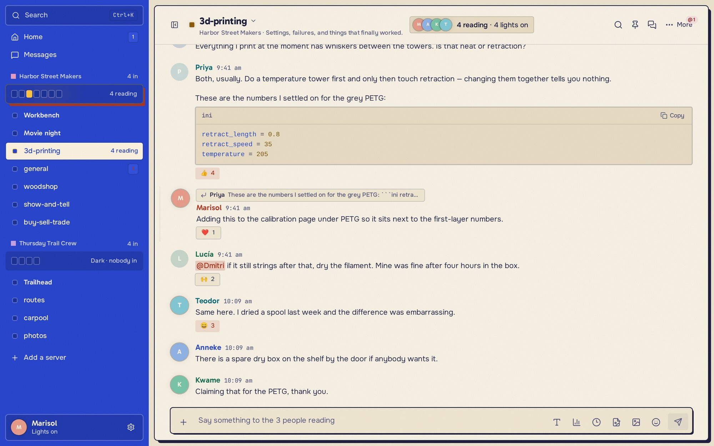 | 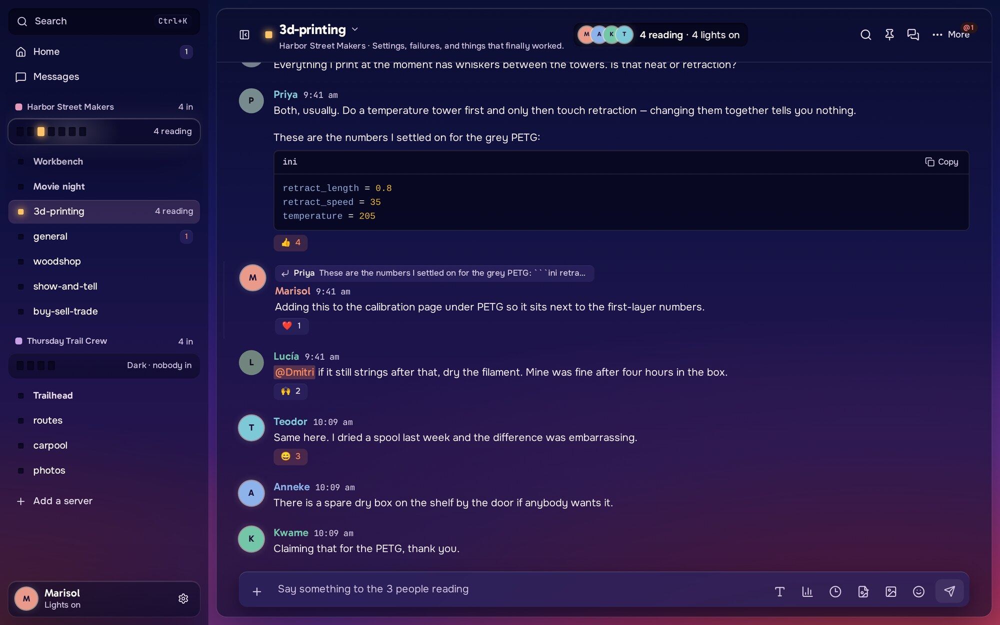 | 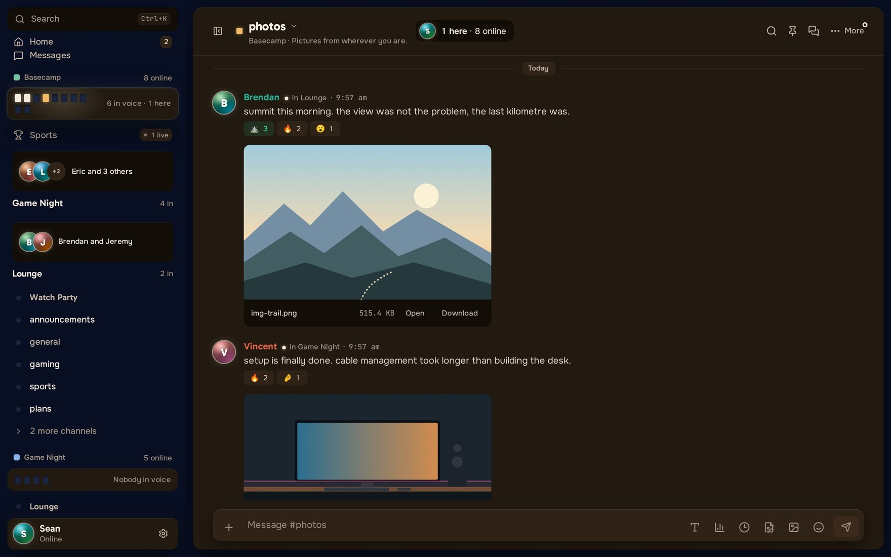 |
| Paper & ink | Dusk sky | Night |

## Good to know

Things that will come up, in rough order of how likely you are to hit them. The full list
lives in [known limitations](docs/known-limitations.md) and in the release notes.

- The browser shows a certificate warning the first time anyone visits, because a new
  server makes its own certificate and browsers do not recognize it. Choose Advanced, then
  Continue; it happens once per browser. The desktop app trusts the server's certificate by
  itself and never asks. Pointing a domain name at the server and turning on automatic
  certificates (`[tls.acme]`) gets rid of the warning for good.
- Joining a call from the browser needs a Chromium-based browser, such as Chrome or Edge.
  It depends on pinning that self-made certificate by fingerprint, which Chromium supports
  and Firefox and Safari do not. The desktop app is unaffected and works in any case; if a
  call fails, Settings → Voice & Video has a connection check that says which step broke.
- The desktop app does not update itself yet. That needs a signed update file published
  with each release, which isn't set up. Download the new version when there is one; for
  the server, re-run the install command.
- macOS builds are unsigned unless a Developer ID is configured, so the first launch needs
  right-click → Open. The macOS packages are built by CI rather than run by hand, so
  expect rough edges. macOS system-audio capture isn't implemented, so
  a screen share from a Mac carries no system sound.
- Linux screen sharing works but leans on your desktop's PipeWire and portal setup, so try
  it before you need it.
- NVIDIA's proprietary driver and WebKit don't get along. On those machines the Linux app
  turns off WebKit's GPU compositing at startup, because WebKitGTK crashes against that
  driver and the window never paints. Video still decodes on the GPU; only the interface is
  affected. The AppImage is a separate problem and is still broken there, so install the
  `.deb` or build from source. `PARACORD_WEBKIT_ACCELERATION=ondemand` overrides the choice
  if your driver has since been fixed.
- The Windows installer has been checked by tools but not run by hand on a Windows
  machine. If it misbehaves, download `install.ps1` and run it
  with `powershell -ExecutionPolicy Bypass -File .\install.ps1`.
- After a long time away the desktop app sometimes opens as "Unknown user" with no servers,
  instead of taking you to the sign-in screen. Open Settings, log out, and sign in again.
- There is no way to publish a bot to the bot store, so it is empty. A bot can only be
  installed by whoever made it.

## Running it

### Networking

One port number covers everything, over both protocols:

| | Carries |
|---|---|
| TCP `8443` | the web client, the API and the realtime connection |
| UDP `8443` | voice, video and screen sharing |

The server asks the router to forward both when it starts, using UPnP or NAT-PMP. If the
router refuses, forward both by hand. UDP is the half people forget, and calls are silent
without it. [Friends outside your network](docs/port-forwarding.md) has the steps and a way
to check it worked. Under Docker the app stays on loopback and a reverse proxy provides the
public HTTPS.

### Data and TLS

| | Default | Other option |
|---|---|---|
| Database | SQLite | PostgreSQL |
| Uploads | local filesystem | S3-compatible storage, in a build that enables it |
| Media | Paracord's QUIC/WebTransport stack | LiveKit, if you want a WebRTC SFU |
| HTTPS | a certificate the server makes itself | a reverse proxy, or ACME certificates |

SQLite carries a small server fine. PostgreSQL is the one to move to for sustained
day-to-day use; the offline `migrate-to-postgres` command copies an existing SQLite
database across, has a dry-run mode, and verifies row counts before you commit to it.

### Downloads

Desktop builds are on the [releases page](../../releases/latest), or you can just open the
web client the server already serves.

| | File | Notes |
|---|---|---|
| Windows | `Paracord-Setup-<ver>.exe` | the guided installer, and the one to use. `Paracord_<ver>_x64_en-US.msi` is there too |
| Linux | `Paracord_<ver>_amd64.AppImage` | portable, no install. Or `Paracord_<ver>_amd64.deb` / `Paracord-<ver>-1.x86_64.rpm` |
| macOS | `Paracord_<ver>_aarch64.dmg` | Apple Silicon. `Paracord_<ver>_x64.dmg` for Intel. Unsigned: right-click → Open the first time |
| Browser | nothing to install | open `https://<your-server>:8443`, which the server serves itself |

Server packages are on the same page: `paracord-server-linux-x64-<ver>.tar.gz`,
`paracord-server-windows-x64-<ver>.zip`, `paracord-server-macos-arm64-<ver>.tar.gz` and
`paracord-server-macos-x64-<ver>.tar.gz`.

The desktop app asks for your invite link on first launch. A plain server address works
too.

## Architecture

The server is a Rust workspace: axum on Tokio, SQLx over SQLite or PostgreSQL, a REST API
and a WebSocket gateway, with Argon2 passwords, JWT sessions and Ed25519 identity keys. The
client is React 19, TypeScript, Tailwind CSS v4 and Zustand, wrapped in a Tauri v2 shell
for the desktop builds.

```text
crates/
├── paracord-server       # the binary: config, TLS, embedded web client
├── paracord-api          # HTTP API
├── paracord-ws           # realtime gateway
├── paracord-core         # permissions, services, event bus
├── paracord-db           # SQLite and PostgreSQL persistence
├── paracord-models       # shared types and permission flags
├── paracord-transport    # QUIC and WebTransport
├── paracord-relay        # encrypted media routing
├── paracord-codec        # Opus, RNNoise and VP9
├── paracord-media        # file storage, optional LiveKit
└── paracord-federation   # signed server-to-server protocol

client/                   # React web app and Tauri desktop shell
packages/paracord-bot-sdk # bot SDK
```

Release builds compile `client/dist` into `paracord-server`, so the single binary serves
the web client itself.

## Development

You need [Rust 1.88 or newer](https://rustup.rs/), [Node 22 or
newer](https://nodejs.org/), libvpx for VP9 video and screen sharing, and Tauri's platform
dependencies if you're building the desktop app. `CLAUDE.md` has the per-platform notes for
libvpx.

Run the client against a local server:

```bash
# terminal 1
cd client && npm install && npm run dev

# terminal 2
cargo run --bin paracord-server --no-default-features
```

Vite serves `http://localhost:1420` and proxies the API to the server. The
`--no-default-features` flag skips embedding the web client, which you have no build of yet.

Check and test:

```bash
cargo fmt --all -- --check
cargo clippy --workspace -- -D warnings
cargo test --workspace

cd client
npm run typecheck
npm test              # typecheck plus unit tests
npm run test:e2e      # Playwright
```

Build a release server with the current web client inside it, then the desktop app:

```bash
cd client && npm install && npm run build && cd ..
cargo build --release --bin paracord-server

cd client && npx tauri build
```

The `vpx` feature in `paracord-codec` is on by default and turning it off to get past a
build error is the wrong move: the build succeeds and video and screen sharing then fail at
runtime with nothing to explain why. Fix the libvpx setup instead. On recent Linux
toolchains the AppImage build needs `NO_STRIP=1`, because linuxdeploy's bundled `strip`
cannot read the relocation sections a modern linker emits.

## Documentation

| Guide | Covers |
|---|---|
| [Getting Started](docs/getting-started.md) | first run, the setup link, invites, media choices |
| [Sports](docs/sports.md) | a scoreboard for a server, and score updates in a channel |
| [Friends outside your network](docs/port-forwarding.md) | what to change on the router, and how to check it |
| [Deployment](docs/deployment.md) | a domain name, TLS at a proxy, PostgreSQL, backups |
| [Docker Setup](docs/docker-setup.md) | compose services, volumes, reverse proxy |
| [Known Limitations](docs/known-limitations.md) | the full list of what does and doesn't work |
| [AutoMod](docs/automod.md) | rules, triggers, actions, exemptions, the rule API |
| [Bot Development](docs/bot-development.md) | bots, commands, interactions, webhooks |
| [Federation Protocol](docs/federation-protocol.md) | signed requests between servers and the trust model |
| [Backup Recovery](docs/backup-recovery.md) | restoring an archive, and what it can't restore |
| [Release Notes](RELEASE_NOTES.md) | what changed in each release |

## License and contributing

Paracord is source-available rather than open source, under the [Paracord Source-Available
License](LICENSE). You can run it for anything, including a business. You can read the
source, modify it for your own machines, and pass the official releases around unchanged.
Publishing a modified version, or a fork for other people to use, needs written permission
from the author.

Issues and pull requests are welcome. For a bug, say what you did and what happened. If it
involves voice, screen sharing or encryption, include the platform and whether you were in
the browser or the desktop app, because those behave differently.
