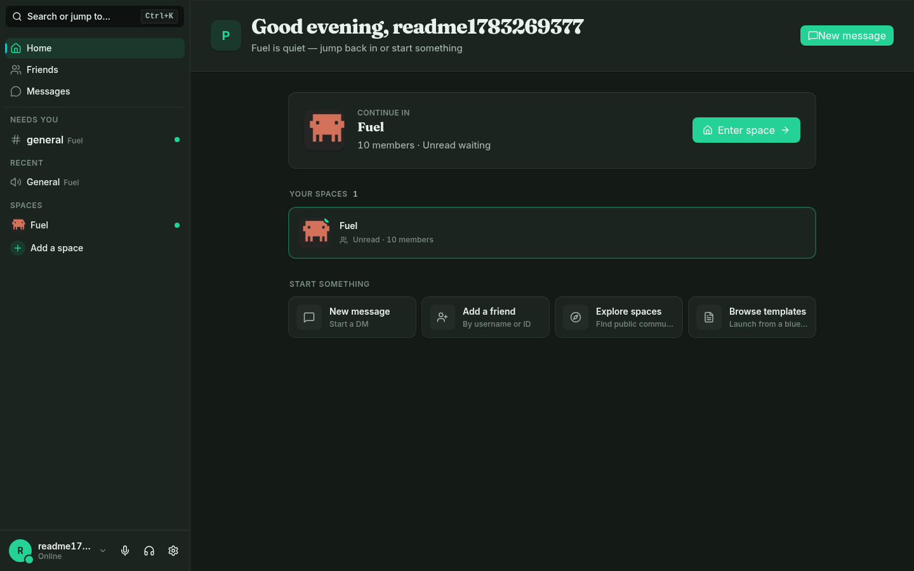
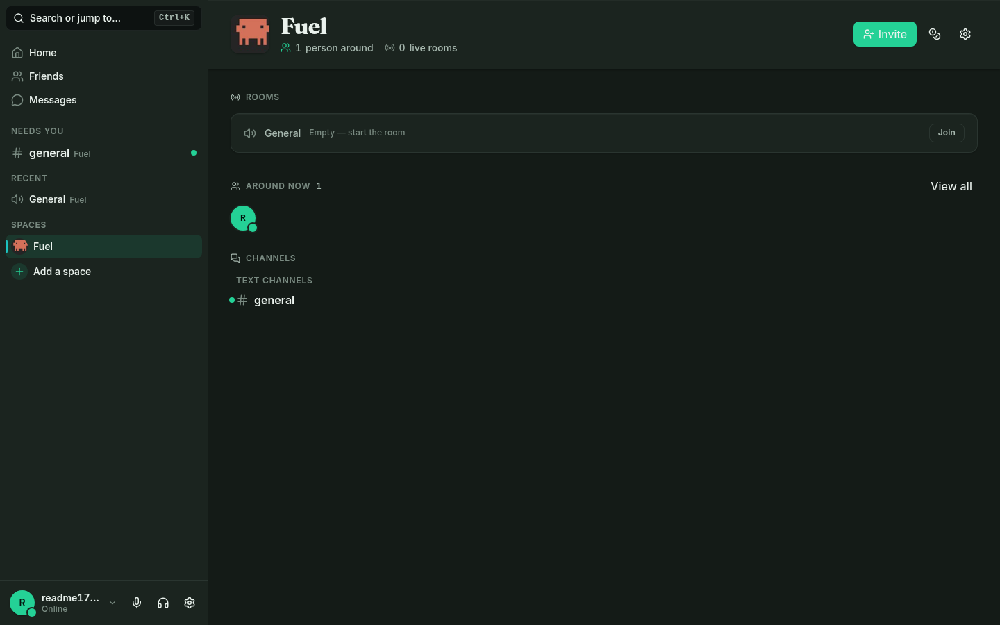
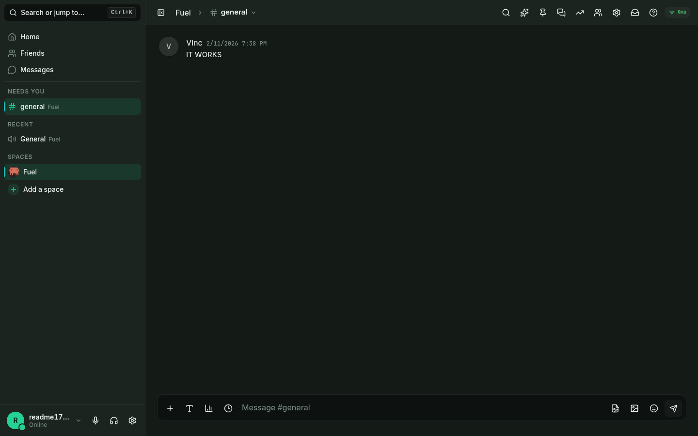
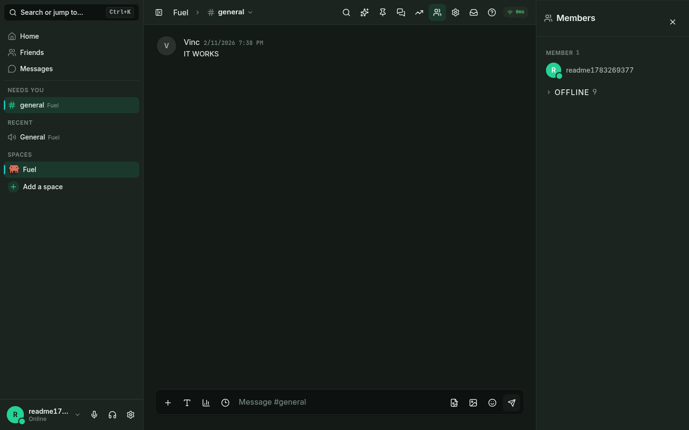
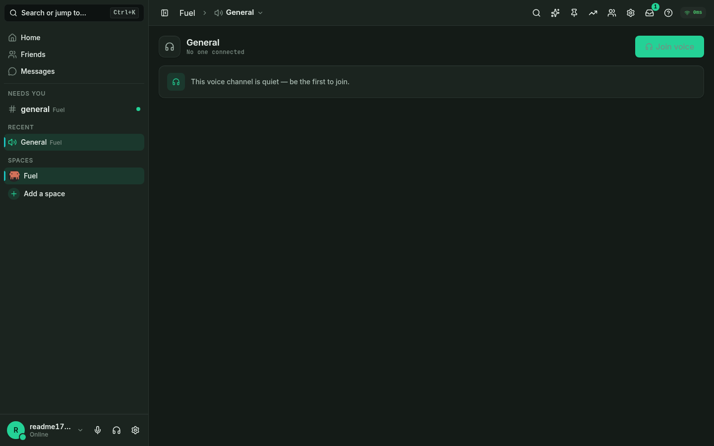
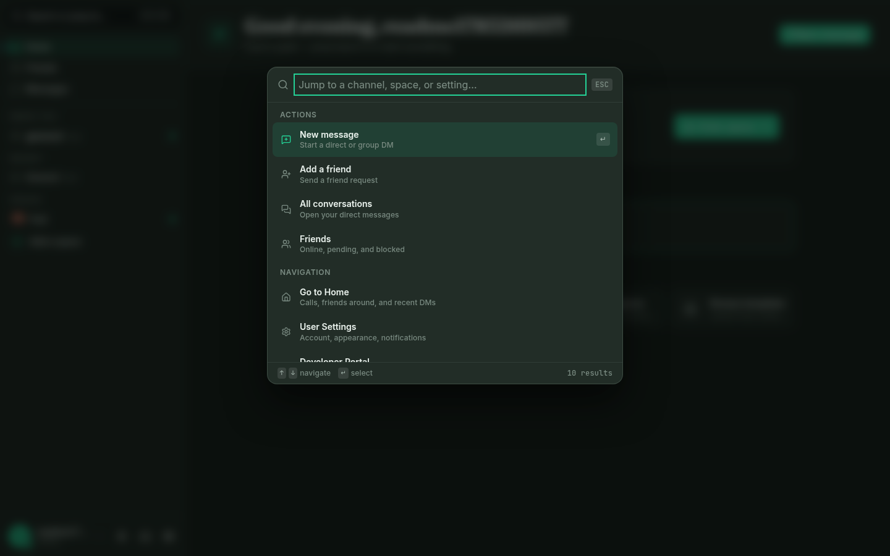
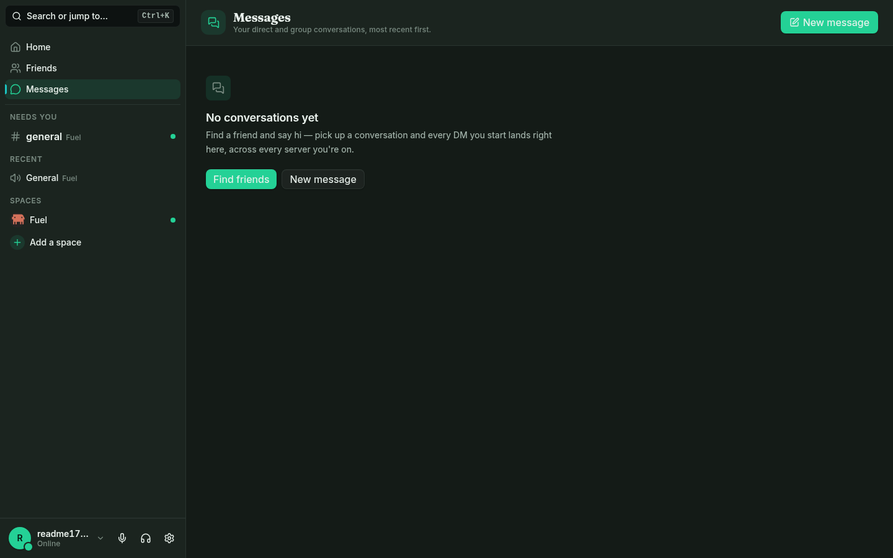
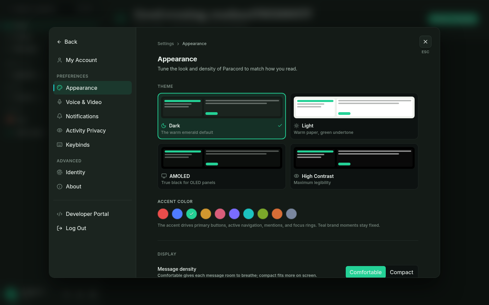
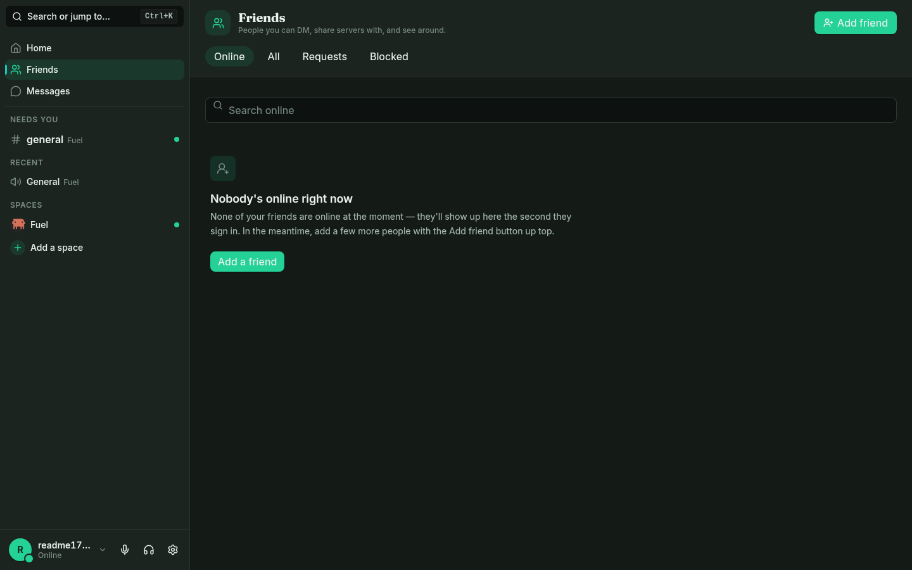
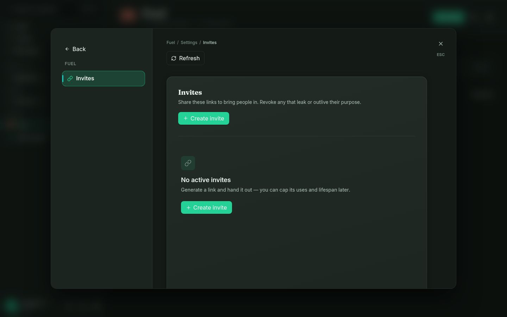

<p align="center">
  
</p>

<p align="center">
  <strong>Self-hosted community chat</strong> — native QUIC voice &amp; video,<br/>
  no third-party media cloud required.
</p>

<p align="center">
  Paracord is a <strong>source-available</strong>, self-hostable Discord-style platform:
  guilds, channels, DMs, bots, and optional federation on your hardware.
  Voice and video use Paracord’s own QUIC/WebTransport engine by default — LiveKit is optional.
</p>

<p align="center">
  <a href="../../releases/latest"></a>
  &nbsp;
  
  &nbsp;
  
</p>

<p align="center">
  <a href="../../releases/latest">Download</a> &bull;
  <a href="#quick-start">Quick Start</a> &bull;
  <a href="docs/getting-started.md">Getting Started</a> &bull;
  <a href="docs/deployment.md">Deployment</a> &bull;
  <a href="#features">Features</a> &bull;
  <a href="#development">Development</a> &bull;
  <a href="docs/known-limitations.md">Known Limitations</a> &bull;
  <a href="#license--contributing">License</a>
</p>

<p align="center">
  Current release: <strong>v1.0.0</strong> · first public release
</p>

---

## What is Paracord?

One binary (or one `docker compose up`) gives you spaces, text and voice channels, forums, stages, DMs, roles, moderation, bots, and optional server-to-server federation — without handing your community’s data to a third-party host.

- **First account owns the server** — the first registered user becomes owner/admin.
- **Native QUIC media by default** — voice, video, and screen share over QUIC (desktop) / WebTransport (browser), with LiveKit available only if you opt in.
- **Zero-config first run** — config, JWT secret, SQLite, and (for the binary) self-signed TLS are created automatically.

---

## Screenshots


*Home — pick up where you left off, with Needs you / Recent / Spaces in the unified sidebar*

| Unified Stream | Rooms |
| :---: | :---: |
|  |  |
| **Unified Stream** — attention across every connected server | **Rooms** — presence-first home for each space |

| Messaging | Context panel |
| :---: | :---: |
|  |  |
| **Messaging** — channels, markdown, reactions, and uploads | **Context panel** — members, threads, pins, and search on demand |

| Voice lobby | Command palette |
| :---: | :---: |
|  |  |
| **Voice lobby** — join voice from the channel (connected grid not shown) | **Command palette** — jump anywhere with Ctrl/⌘K |

| DMs | Appearance |
| :---: | :---: |
|  |  |
| **DMs** — direct and group conversations | **Appearance** — Emerald Commons themes and accents |

<details>
<summary>More screenshots</summary>

| Friends | Space settings |
| :---: | :---: |
|  |  |

</details>

---

## Features

### Self-hosting

No secrets to invent, no voice stack to wire up, no database to provision for a small instance. Start the server and it creates `config/paracord.toml`, a random JWT secret, the SQLite database, and — for the binary path — a self-signed TLS certificate, then prints the URL to open. `docker compose up` needs no `.env` editing; secrets persist into the data volume on first run.

PostgreSQL is recommended for sustained multi-user production. An offline migrator (`paracord-server migrate-to-postgres`) is available when you outgrow SQLite.

### Native QUIC media (default)

Voice, video, and screen share run on Paracord’s own media stack (`paracord-transport`, `paracord-relay`, `paracord-codec`) with an E2EE media path. Desktop clients speak raw QUIC; browsers use WebTransport. **One port for remote access:** `8443` over **both TCP and UDP** (HTTPS + gateway on TCP, native media on UDP).

LiveKit remains an optional WebRTC SFU (`docker compose --profile livekit`) for legacy interop or large SFU-scale rooms — not required for typical use.

Desktop VP9 screen share and video need **libvpx** at build time. The `vpx` feature stays enabled by default; do not disable it to work around build issues — fix the environment instead (see [Development](#development)).

### Emerald Commons + Rooms

A mature design language: warm-neutral dark surfaces, a calibrated emerald primary accent, runtime CSS tokens, and four themes (dark, light, AMOLED, high-contrast) plus custom CSS. See [docs/design-spec.md](docs/design-spec.md).

The client layout is **Rooms + Unified Stream**: one attention-ranked sidebar (Needs you / Recent / Spaces across connected servers), a full-width content pane, and a toggleable context panel. Opening a space lands on its **Rooms** home — live rooms, presence, and grouped channels. See [docs/layout-spec.md](docs/layout-spec.md).

### Bots & webhooks

Developer portal, bot accounts, slash commands, and webhooks. See [docs/bot-development.md](docs/bot-development.md).

### Federation (MVP)

Server-to-server federation via Ed25519-signed HTTP envelopes. **Disabled by default** — enable only with trusted peers, and validate every flow before public use. Protocol notes: [docs/federation-protocol.md](docs/federation-protocol.md).

### Privacy & crypto

- Optional E2EE for **direct messages** (X25519 + AES-GCM)
- E2EE for voice/video frames on the **native media** path
- At-rest encryption (AES-256-GCM) for configured secrets/data paths — not “everything on disk is E2EE”
- Session JWT auth and Ed25519 cryptographic identity

Guild and channel messages are visible to the server operator (and anyone with access to the database). Prefer optional E2EE DMs when that boundary matters.

### Multi-server

Connect to multiple Paracord hosts. The unified sidebar merges attention across them; your Ed25519 identity carries across servers.

### Platform checklist

| Capability | Status |
|------------|--------|
| Guilds, text / voice / stage / forum channels, threads | Yes |
| Roles & permissions (30 flags), moderation, audit logs | Yes |
| Friends, invites, discovery, templates, polls, events, emoji | Yes |
| File uploads + guild storage policies | Yes |
| Desktop client (Tauri v2) | **Windows** and **Linux** |
| Browser client (embedded UI) | Yes |
| macOS desktop / system audio capture | Not supported |

---

## Quick Start

### Path A — single executable

```bash
# Linux (from a release tarball or local build)
./paracord-server init   # optional: write config + print next steps, exit
./paracord-server        # start (-c <path> for a custom config)
```

```powershell
.\paracord-server.exe
```

On first run the binary generates config, database, and TLS certs, then prints the URL. Register the **first account** — it becomes the server owner.

### Path B — Docker Compose

```bash
git clone https://github.com/Scoduglas1999/Paracord.git
cd Paracord
docker compose up -d
```

Compose publishes **HTTP on `127.0.0.1:8090` only** (loopback by design) and native media on UDP `8443`. Put a TLS reverse proxy in front for browser mic/camera; the desktop client speaks raw QUIC and is unaffected. See [docs/getting-started.md](docs/getting-started.md) and [docs/docker-setup.md](docs/docker-setup.md).

### Path C — build from source (embedded UI)

```bash
git clone https://github.com/Scoduglas1999/Paracord.git
cd Paracord
cd client && npm install && npm run build && cd ..
cargo build --release --bin paracord-server
./target/release/paracord-server
```

### One port to forward

For access outside your network, forward **`8443` over both TCP and UDP** to the host running the binary. TCP carries HTTPS (web UI + gateway); UDP carries native QUIC voice/video.

---

## Desktop Client

Installers ship on the [Releases](../../releases/latest) page when published.

| Platform | Format |
|----------|--------|
| Windows  | `.exe` / `.msi` |
| Linux    | `.deb` (and release tarballs as published) |
| Browser  | `https://<host>:8443` (binary TLS) or your reverse-proxy URL |

The desktop app can auto-trust self-signed server certificates and uses the native Opus / RNNoise / VP9 pipeline over QUIC when built with libvpx.

---

## Architecture

Rust workspace (axum, SQLx SQLite/Postgres) + Tauri v2 / React 19 client. Native media: `paracord-transport` (QUIC/WebTransport), `paracord-relay`, `paracord-codec` (Opus, RNNoise, VP9). Optional LiveKit via `paracord-media`. Federation: `paracord-federation`. The web UI embeds in `paracord-server` (`embed-ui`, on by default for release builds).

| Layer | Technology |
|-------|------------|
| Server | Rust (axum, tokio, SQLx) — 13 crates |
| Client | Tauri v2 + React 19 + TypeScript + Tailwind CSS v4 |
| Database | SQLite (default) or PostgreSQL |
| Voice / video | Native QUIC/WebTransport + optional LiveKit SFU |
| Auth | Argon2, JWT sessions, Ed25519 identity |
| State (client) | Zustand v5 |

```
paracord/
├── crates/
│   ├── paracord-server/      # Binary entry, TLS, config, embed-ui
│   ├── paracord-api/         # REST routes
│   ├── paracord-ws/          # WebSocket gateway
│   ├── paracord-core/        # Business logic, permissions, event bus
│   ├── paracord-db/          # SQLite / PostgreSQL via SQLx
│   ├── paracord-models/      # Shared types & permission flags
│   ├── paracord-transport/   # QUIC / WebTransport
│   ├── paracord-relay/       # Media routing, VAD, E2EE
│   ├── paracord-codec/       # Opus, RNNoise, VP9
│   ├── paracord-federation/  # Server-to-server (MVP)
│   ├── paracord-media/       # Storage + optional LiveKit
│   └── …
├── client/                   # Tauri + React desktop / web UI
└── docker-compose.yml
```

---

## Development

### Prerequisites

- [Rust 1.88+](https://rustup.rs/)
- [Node.js 22+](https://nodejs.org/)

### Run locally (two terminals)

```bash
git clone https://github.com/Scoduglas1999/Paracord.git
cd Paracord

# Terminal 1 — Vite client (:1420), proxies to the server
cd client && npm install && npm run dev

# Terminal 2 — API/gateway without embedding UI
cargo run --bin paracord-server --no-default-features
```

### Build & test

```bash
cargo check --workspace
cargo test --workspace
cd client && npm test
```

```bash
# Production client → client/dist/
cd client && npm run build

# Release server with embedded UI
cargo build --release --bin paracord-server
```

### Desktop client build (libvpx required)

The desktop client links **libvpx** for VP9. The `vpx` feature is on by default and required for screen share / video. **Do not disable it.**

```bash
# Linux — install libvpx (+ WebKitGTK for Tauri)
sudo pacman -S libvpx webkit2gtk-4.1          # Arch / CachyOS
# sudo apt install libvpx-dev webkit2gtk-4.1-dev   # Debian / Ubuntu

cd client && npm install && npx tauri build
```

Windows developers source `scripts/set-vpx-env.ps1` for vcpkg libvpx paths. Full notes: [CLAUDE.md](CLAUDE.md) / [AGENTS.md](AGENTS.md).

### Linting

```bash
cargo fmt --all -- --check
cargo clippy --workspace -- -D warnings
```

---

## Documentation

| Doc | Description |
|-----|-------------|
| [Getting Started](docs/getting-started.md) | First-run walkthrough |
| [Deployment](docs/deployment.md) | TLS, UDP forwarding, `PUBLIC_URL`, PostgreSQL, backups |
| [Docker Setup](docs/docker-setup.md) | Compose reference |
| [Design Spec](docs/design-spec.md) | Emerald Commons |
| [Layout Spec](docs/layout-spec.md) | Rooms + Unified Stream |
| [Bot Development](docs/bot-development.md) | Bots, slash commands, webhooks |
| [Federation Protocol](docs/federation-protocol.md) | MVP federation envelopes |
| [Known Limitations](docs/known-limitations.md) | Support boundaries — read before production |
| [RELEASE_NOTES.md](RELEASE_NOTES.md) | Changelog |

---

## Known Limitations

Paracord `v1.0.0` is the first public release. Before you rely on it for a public community, skim **[docs/known-limitations.md](docs/known-limitations.md)** — especially federation readiness, Linux capture/distro variance, Docker loopback HTTP, and desktop updater expectations for unsigned builds.

---

## License & Contributing

Paracord is **source-available** under the [Paracord Source-Available License](LICENSE) (Copyright © 2026 Sean Douglas). You may use, study, and modify it for personal use and share official releases. Redistribution of modified versions and derivative works requires written permission from the author.

Issues and pull requests are welcome on GitHub. For security concerns, review the docs under [docs/](docs/) (threat model and security checklists) before reporting.

---

<p align="center">
  <sub>Built for communities who want their conversations back.</sub>
</p>
