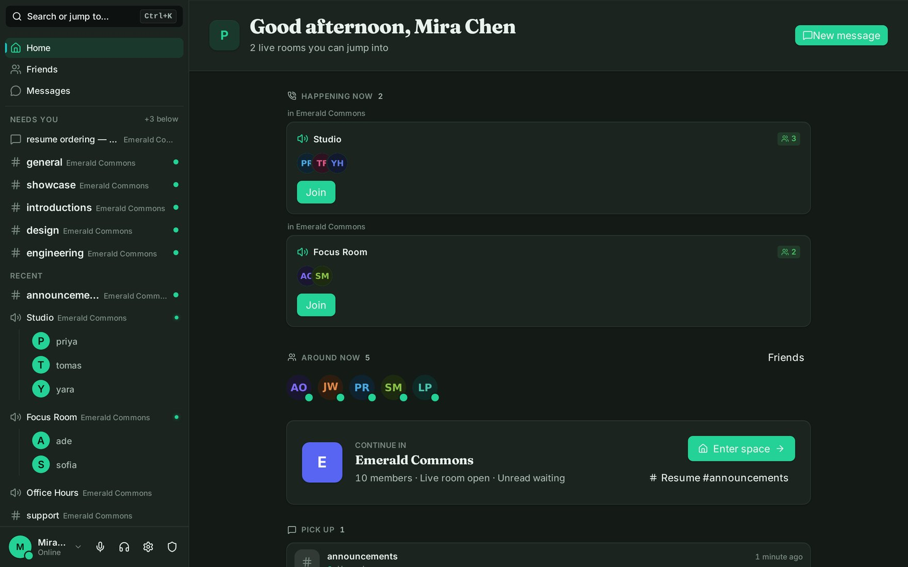
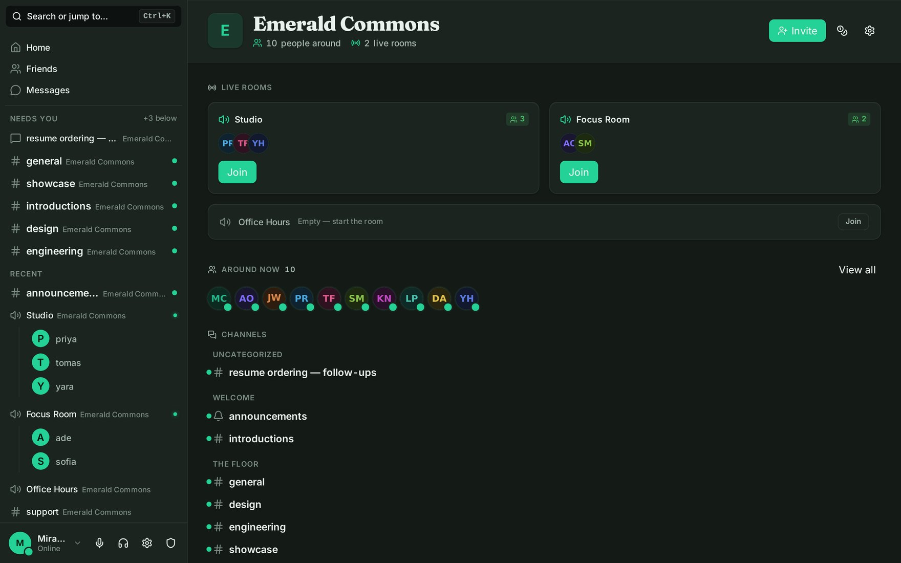
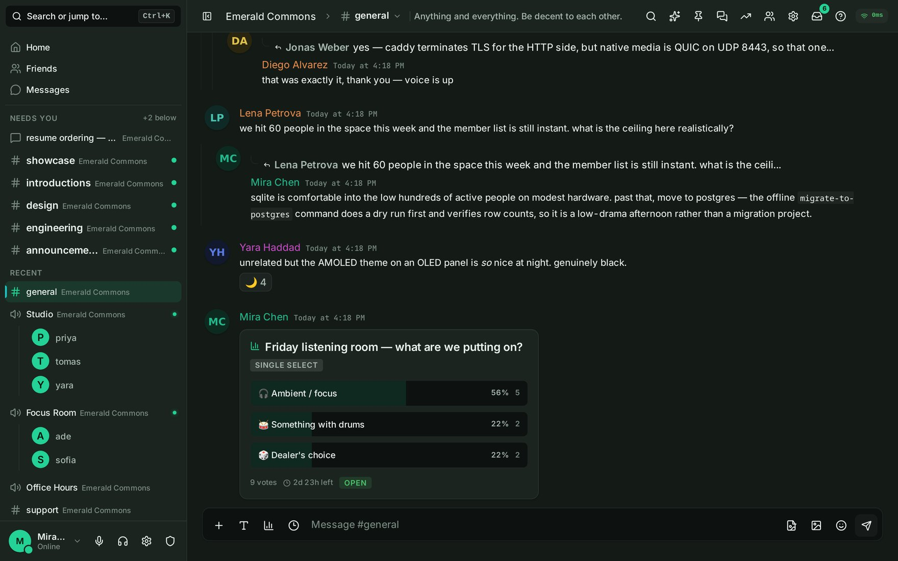
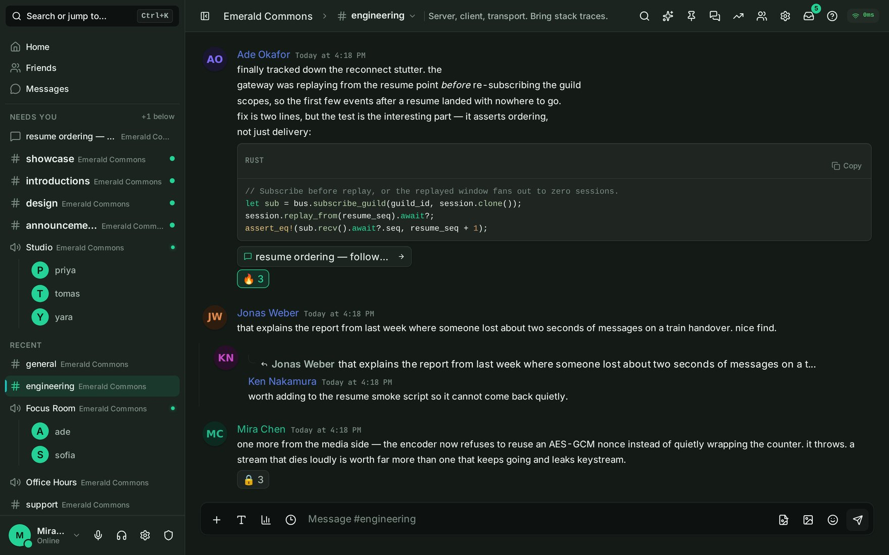
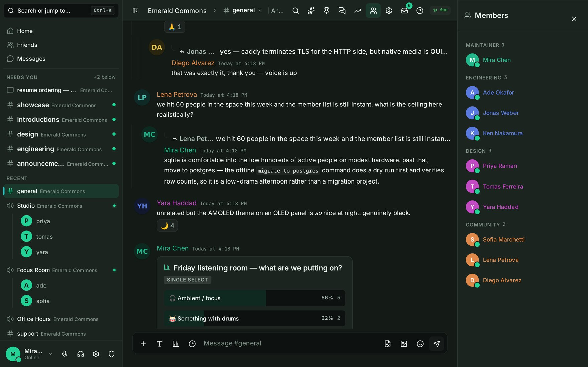
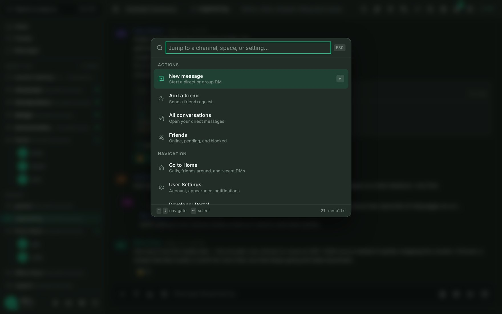
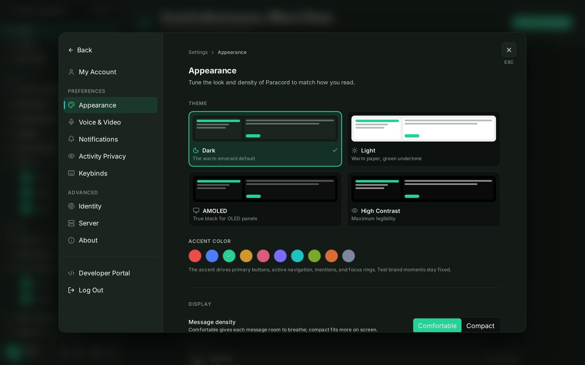
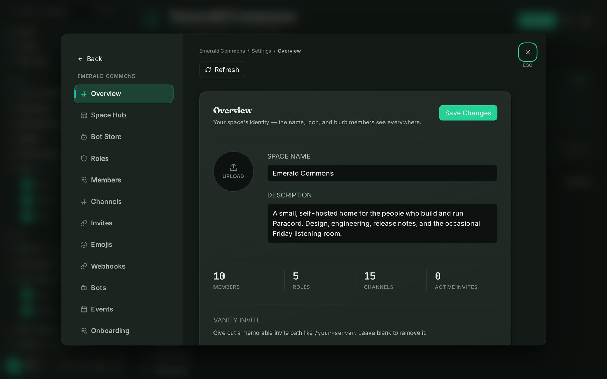

<p align="center">
  
</p>

<p align="center">
  <strong>Self-hosted community chat with first-party voice, video, and screen sharing.</strong><br/>
  Keep the server, the conversations, and the media path under your control.
</p>

<p align="center">
  <a href="../../releases/latest"></a>
  
  <a href="LICENSE"></a>
</p>

<p align="center">
  <a href="../../releases/latest">Download</a> ·
  <a href="#quick-start">Quick start</a> ·
  <a href="#what-paracord-includes">Features</a> ·
  <a href="#running-it">Deployment</a> ·
  <a href="#development">Development</a> ·
  <a href="docs/getting-started.md">Documentation</a>
</p>

<p align="center">
  Current release: <strong>v2.0.0</strong> — see the <a href="RELEASE_NOTES.md">release notes</a>
</p>

---

Paracord is a source-available, Discord-style community platform that you run yourself. One server hosts spaces, text and voice rooms, direct messages, roles, moderation, bots, events, and community tools — without renting a third-party media service or handing your members' conversations to someone else.

The client opens on a single Home rather than a wall of server icons. Mentions, unread conversations, live rooms, and direct messages are ranked together, so you see what actually wants your attention instead of sweeping each space by hand.



## Why Paracord

- **Own the deployment.** One server binary, or Docker Compose. SQLite works out of the box; PostgreSQL is there when the instance outgrows it.
- **Own the media path.** Voice, video, and screen share run on Paracord's native QUIC/WebTransport stack by default. LiveKit is an option, not a dependency.
- **Start without a configuration ceremony.** First run writes the config, generates a JWT signing secret and SQLite database, and — for the standalone binary — issues a self-signed certificate. Then it prints the URL to open.
- **Use one client everywhere.** Connect to several Paracord servers and move between their spaces, conversations, and notifications without switching apps.
- **Shape the community.** Roles, permissions, onboarding, moderation, AutoMod, bots, webhooks, storage policy, events, and audit logs are all managed in the app.
- **See what the server is doing.** A built-in health view reports backups, database size, transport security, and capacity — and tells you what to fix, not just what broke.

## A look around

Spaces open on the people who are already there. Rooms that have someone in them come first; the rest stay one click away.



Conversations carry what you would expect them to: replies, reactions, threads, polls, attachments, and code that arrives readable.

| | |
| :--- | :--- |
|  |  |
| Markdown, attachments, reactions, polls, scheduled messages, commands, GIFs, stickers, and embeds. | Syntax-highlighted code blocks, and threads that split a tangent off without derailing the channel. |

Context panels stay out of the way until you ask for them, and the command palette reaches anything you can name.

| | |
| :--- | :--- |
|  |  |
| Members, threads, pins, inbox, search, and summaries open beside the conversation rather than on top of it. | Jump to any action, space, channel, DM, or setting with <kbd>Ctrl</kbd>/<kbd>⌘</kbd> + <kbd>K</kbd>. |

The client is yours to set up, and so is the space.

| | |
| :--- | :--- |
|  |  |
| Dark, light, AMOLED, and high-contrast themes; accent colors; message density; locale; and guarded custom CSS. | Roles, channels, invites, bots, events, onboarding, economy, storage, moderation, reports, and audit logs. |

## What Paracord includes

### Conversations

- Text channels, direct messages, and group DMs
- Threads, replies, mentions, reactions, pins, and saved messages
- Markdown, syntax-highlighted code blocks, attachments, image previews, and rich embeds
- Polls, scheduled messages, slash commands, GIFs, stickers, and custom emoji
- Search, inbox, typing state, unread tracking, and notification controls
- End-to-end encrypted direct messages

### Voice, video, and streaming

- Native QUIC media for the desktop client, WebTransport for browsers
- Voice rooms, video grids, screen sharing, stream viewing, and device controls
- Opus audio, RNNoise noise suppression, VP9 video, speaker detection, and encrypted media frames
- Optional LiveKit/WebRTC path for deployments that specifically want an SFU

Desktop VP9 video and screen sharing need **libvpx** at build time. The `vpx` feature is on by default and should stay that way.

### Spaces and community operations

- Text, voice, stage, and forum channels
- Roles and granular permissions
- Invites, discovery, templates, welcome screens, and member onboarding
- AutoMod rules — keywords, patterns, links and invites, mention floods, and spam — with block, timeout, and moderator-alert actions
- Member management, bans, reports, moderation templates, and audit logs
- Events, custom emoji, file-storage policy, and a configurable community economy
- Server hub settings and public-community discovery

### Extensibility and federation

- Bot applications, slash commands, interaction components, and a developer portal
- Webhooks and a published [bot SDK](packages/paracord-bot-sdk)
- Several connected servers in one client
- Ed25519-signed server-to-server federation

Federation is off by default and should be treated as an explicit trust relationship. Stage and validate the flows you intend to use before turning it on for a public instance.

### Where the privacy boundary sits

Self-hosting decides *where* your data lives. It is not the same promise as end-to-end encryption everywhere, so it is worth being precise:

- Direct messages are end-to-end encrypted; the server relays ciphertext it cannot read.
- Native voice and video frames travel over the encrypted media path.
- **Space and channel messages are readable by the server**, and by anyone with database access.
- At-rest AES-256-GCM protection covers configured secret and file paths. It is not a blanket claim that every database column is encrypted.

Read the [known limitations](docs/known-limitations.md) and the deployment guide before running Paracord for a public or high-risk community.

## Quick start

The first account registered on a new instance becomes the server owner and administrator. Start the server, then claim that account before you share the address with anyone.

### Standalone server

Download the server archive from [Releases](../../releases/latest), extract it, and run:

```bash
# Linux
./paracord-server init   # optional: write the config and print the first-run guide
./paracord-server
```

```powershell
# Windows
.\paracord-server.exe
```

First run creates `config/paracord.toml`, a random JWT signing secret, the SQLite database, and a self-signed certificate, then prints the URL to open.

### Docker Compose

```bash
git clone https://github.com/Scdouglas1999/Paracord.git
cd Paracord
docker compose up -d
```

The default stack needs no `.env` file. It publishes HTTP on `127.0.0.1:8090` and native media on UDP `8443`. Put a TLS reverse proxy in front before exposing the browser client — browsers require HTTPS for microphone, camera, screen share, and WebTransport.

For a walk through the first run, see [Getting Started](docs/getting-started.md). For TLS, PostgreSQL, backups, public URLs, and proxy guidance, see [Deployment](docs/deployment.md) and [Docker Setup](docs/docker-setup.md).

## Running it

### Networking

The standalone server's default remote-access path uses port `8443` over both protocols:

| Protocol | Carries |
|---|---|
| TCP `8443` | HTTPS, web client, API, and gateway |
| UDP `8443` | Native QUIC/WebTransport media |

Forward **both** when hosting outside your own network — voice needs the UDP half. Docker keeps application HTTP on loopback and expects a reverse proxy to provide public TLS.

### Data

| Component | Default | Production option |
|---|---|---|
| Database | SQLite | PostgreSQL |
| Uploads | Local filesystem | S3-compatible object storage when built and configured for it |
| Media | Native QUIC/WebTransport | Optional LiveKit/WebRTC |
| TLS | Auto-generated self-signed certificate | Reverse proxy or ACME-managed certificate |

SQLite comfortably carries a small instance. PostgreSQL is the recommendation for sustained multi-user production use; the offline `migrate-to-postgres` command supports a dry run and verifies copied row counts before you commit to it.

### Clients

| Client | Support |
|---|---|
| Windows desktop | Tauri v2 installer (`.exe` / `.msi`) |
| Linux desktop | Tauri v2 builds and release packages (`.AppImage` / `.deb`) |
| Browser | Served by the Paracord server or your reverse proxy |
| macOS desktop | Not currently a supported release target |

Windows is the primary native screen and system-audio capture path. Linux screen sharing depends on the distribution's PipeWire and portal setup, and is worth testing before you publish a build. macOS system-audio capture is not implemented.

## Architecture

A Rust workspace with a React/Tauri client:

| Layer | Technology |
|---|---|
| Server | Rust, Axum, Tokio |
| API and realtime | REST plus WebSocket/SSE realtime transport |
| Database | SQLx over SQLite and PostgreSQL |
| Client | React 19, TypeScript, Tauri v2, Tailwind CSS v4 |
| Client state | Zustand |
| Native media | QUIC/WebTransport, Opus, RNNoise, VP9 |
| Optional media | LiveKit/WebRTC |
| Identity and auth | Argon2, JWT sessions, Ed25519 identity |

```text
crates/
├── paracord-server       # executable, config, TLS, embedded web client
├── paracord-api          # HTTP API
├── paracord-ws           # realtime gateway
├── paracord-core         # permissions, services, event bus
├── paracord-db           # SQLite/PostgreSQL persistence
├── paracord-models       # shared models and permission flags
├── paracord-transport    # QUIC and WebTransport
├── paracord-relay        # encrypted media routing
├── paracord-codec        # Opus, RNNoise, and VP9
├── paracord-media        # file storage and optional LiveKit integration
└── paracord-federation   # signed server-to-server protocol

client/                   # React web app and Tauri desktop shell
packages/paracord-bot-sdk # bot SDK
```

Release builds embed `client/dist` into `paracord-server`, so the standalone binary serves the UI itself.

## Development

### Prerequisites

- [Rust 1.88 or newer](https://rustup.rs/)
- [Node.js 22 or newer](https://nodejs.org/)
- libvpx, for desktop VP9 video and screen sharing
- Tauri platform dependencies, when building the desktop app

### Run the web client and server

```bash
# Terminal 1
cd client
npm install
npm run dev
```

```bash
# Terminal 2
cargo run --bin paracord-server --no-default-features
```

Vite serves `http://localhost:1420` and proxies API traffic to the development server.

### Build and test

```bash
# Rust
cargo fmt --all -- --check
cargo clippy --workspace -- -D warnings
cargo test --workspace

# Client
cd client
npm run typecheck
npm test
npm run build
```

Build a release server with the current web client embedded:

```bash
cd client && npm install && npm run build && cd ..
cargo build --release --bin paracord-server
```

Build the desktop client, once the Tauri and libvpx dependencies are in place:

```bash
cd client
npm install
npx tauri build
```

## Documentation

| Guide | Covers |
|---|---|
| [Getting Started](docs/getting-started.md) | First run, owner registration, invites, and media choices |
| [Deployment](docs/deployment.md) | TLS, networking, PostgreSQL, backups, and production hardening |
| [Docker Setup](docs/docker-setup.md) | Compose services, volumes, and reverse proxy setup |
| [AutoMod](docs/automod.md) | Content rules, triggers, actions, exemptions, and the rule API |
| [Known Limitations](docs/known-limitations.md) | Platform and operational support boundaries |
| [Bot Development](docs/bot-development.md) | Bots, commands, interactions, and webhooks |
| [Federation Protocol](docs/federation-protocol.md) | Signed federation envelopes and the trust model |
| [Design Spec](docs/design-spec.md) | The Emerald Commons visual system |
| [Layout Spec](docs/layout-spec.md) | Unified navigation, Home, Rooms, and context panels |
| [API Contracts](docs/api-contracts.md) | API and realtime interface notes |
| [Release Notes](RELEASE_NOTES.md) | What changed in the current release |

## License and contributing

Paracord is **source-available**, not OSI open source. It is distributed under the [Paracord Source-Available License](LICENSE). You may use, study, and modify it for personal use and share official releases; redistributing modified versions or derivative works requires written permission from the copyright holder.

Issues and pull requests are welcome. Please include reproduction details for bugs, and skim the security and deployment docs before reporting behavior that depends on a particular trust boundary.

<p align="center">
  <sub>Built for communities that want their conversations back.</sub>
</p>
