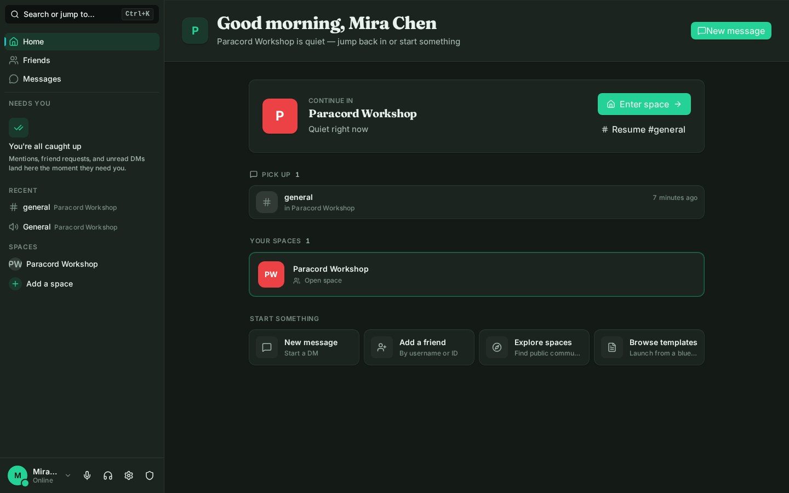
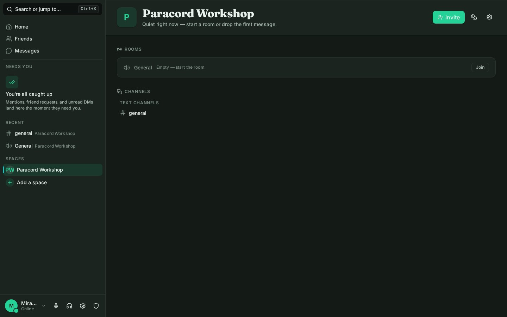
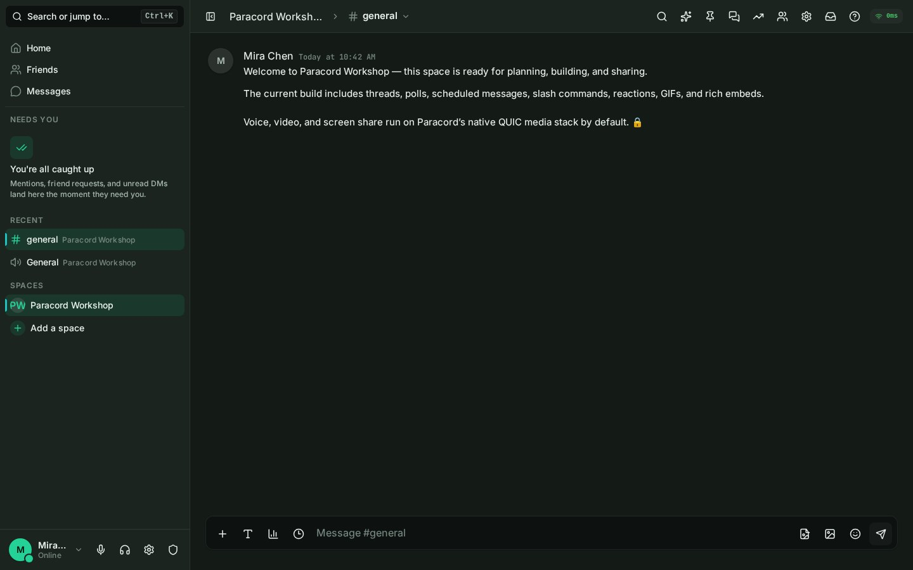
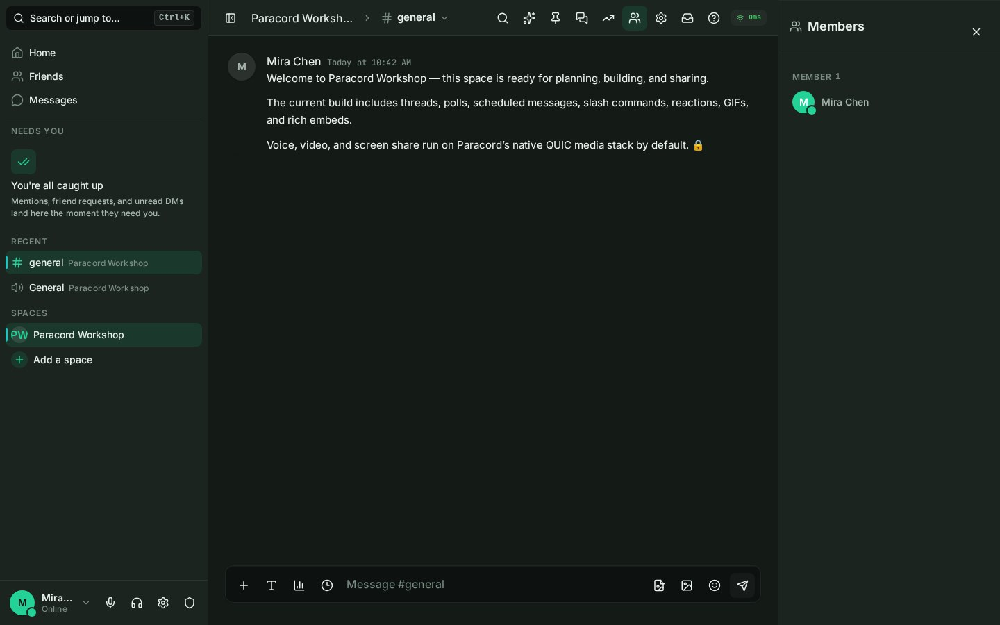
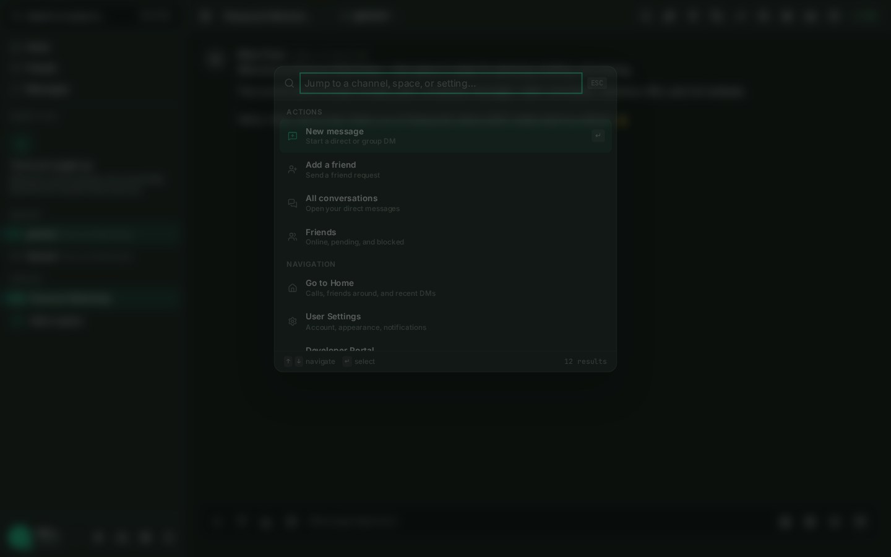
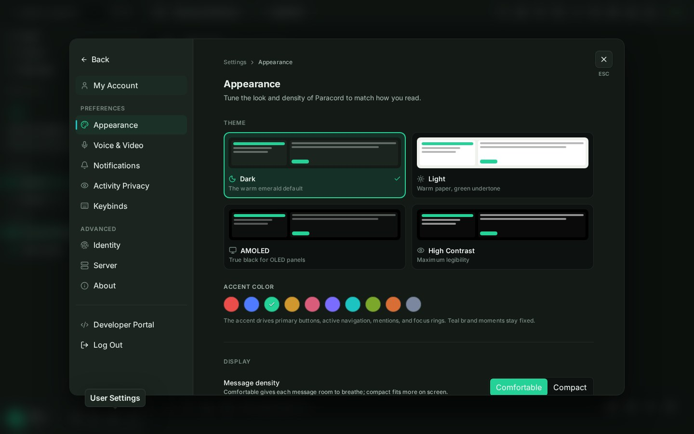
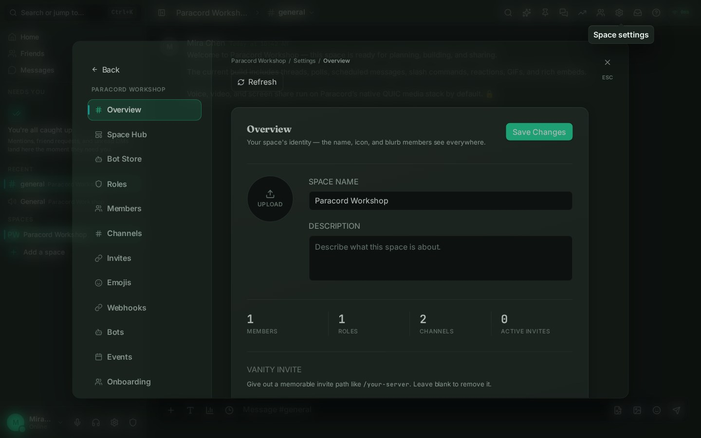

<p align="center">
  
</p>

<p align="center">
  <strong>Self-hosted community chat with first-party voice, video, and screen sharing.</strong><br/>
  Keep the server, the conversations, and the media path under your control.
</p>

<p align="center">
  <a href="../../releases/latest"></a>
  
  <a href="LICENSE"></a>
</p>

<p align="center">
  <a href="../../releases/latest">Download</a> ·
  <a href="#quick-start">Quick start</a> ·
  <a href="#what-paracord-includes">Features</a> ·
  <a href="#deployment-model">Deployment</a> ·
  <a href="#development">Development</a> ·
  <a href="docs/getting-started.md">Documentation</a>
</p>

<p align="center">
  Current release: <strong>v1.0.0</strong>
</p>

---

Paracord is a source-available, Discord-style community platform that you run yourself. A server can host spaces, text and voice rooms, direct messages, roles, moderation, bots, events, onboarding, and community tools without depending on a third-party media service.

The client is built around a unified Home view and presence-first Rooms. Mentions, unread conversations, recent activity, direct messages, and spaces live in one navigation model instead of separate server silos.



## Why Paracord

- **Own the deployment.** Run one server binary or use Docker Compose. SQLite works out of the box; PostgreSQL is available when the instance grows.
- **Own the media path.** Voice, video, and screen share use Paracord's native QUIC/WebTransport stack by default. LiveKit is an optional fallback, not a required dependency.
- **Start without a configuration ceremony.** First run generates the config, JWT secret, SQLite database, and—in the standalone-binary path—a self-signed TLS certificate.
- **Use one client across communities.** Connect to multiple Paracord servers and move between their spaces, conversations, and notifications from the same interface.
- **Shape the community.** Roles, permissions, onboarding, moderation, bots, webhooks, storage policies, events, economy tools, and audit logs are managed in the app.

## The current experience

| Rooms | Messaging |
| :---: | :---: |
|  |  |
| Spaces open on the people and rooms active now. | Markdown, attachments, reactions, polls, threads, scheduled messages, commands, GIFs, stickers, and embeds. |

| Context when you need it | Jump anywhere |
| :---: | :---: |
|  |  |
| Members, threads, pins, inbox, search, and summaries stay out of the way until opened. | Search actions, spaces, channels, DMs, and settings with <kbd>Ctrl</kbd>/<kbd>⌘</kbd> + <kbd>K</kbd>. |

| Personalize the client | Run the space |
| :---: | :---: |
|  |  |
| Dark, light, AMOLED, and high-contrast themes; accent colors; density; locale; and guarded custom CSS. | Roles, channels, invites, bots, events, onboarding, economy, storage, moderation, reports, and audit logs. |

## What Paracord includes

### Conversations

- Text channels, direct messages, and group DMs
- Threads, replies, mentions, reactions, pins, and saved messages
- Markdown, syntax-highlighted code blocks, attachments, image previews, and rich embeds
- Polls, scheduled messages, slash commands, GIFs, stickers, and custom emoji
- Search, inbox, typing state, unread tracking, and notification controls
- Optional client-side encrypted direct messages

### Voice, video, and streaming

- Native QUIC media for the desktop client
- WebTransport media for browsers
- Voice rooms, video grids, screen sharing, stream viewing, and device controls
- Opus audio, RNNoise noise suppression, VP9 video, speaker detection, and media-frame encryption
- Optional LiveKit/WebRTC fallback for deployments that specifically need an SFU

Desktop VP9 video and screen sharing require **libvpx** at build time. The `vpx` feature is enabled by default and should remain enabled.

### Spaces and community operations

- Text, voice, stage, and forum channels
- Roles and granular permissions
- Invites, discovery, templates, welcome screens, and member onboarding
- Member management, bans, reports, moderation templates, and audit logs
- Events, custom emoji, file-storage policy, and configurable community economy
- Server hub settings and public-community discovery

### Extensibility and federation

- Bot applications, slash commands, interaction components, and a developer portal
- Webhooks and a published [bot SDK](packages/paracord-bot-sdk)
- Multiple connected servers in one client
- Ed25519-signed server-to-server federation

Federation is disabled by default and should be treated as an explicit trust relationship. Stage and validate the flows you intend to use before enabling it for a public instance.

### Privacy boundaries

Paracord gives operators control over where data lives, but self-hosting is not the same thing as universal end-to-end encryption:

- Native voice/video media frames use the encrypted media path.
- Direct messages can use the optional client-side encrypted flow.
- Space and channel messages are readable by the server and by anyone with database access.
- At-rest AES-256-GCM protection is available for configured secret and file paths; it is not a blanket promise that every database field is encrypted.

See the [known limitations](docs/known-limitations.md) and deployment documentation before using Paracord for a public or high-risk community.

## Quick start

The first account registered on a new instance becomes the server owner and administrator. Start the server, then claim that account before sharing the instance.

### Standalone server

Download the current server archive from [Releases](../../releases/latest), extract it, and run:

```bash
# Linux
./paracord-server init   # optional: generate config and print the first-run guide
./paracord-server
```

```powershell
# Windows
.\paracord-server.exe
```

On first run, Paracord creates `config/paracord.toml`, a random JWT signing secret, the SQLite database, and a self-signed certificate. The console prints the URL to open.

### Docker Compose

```bash
git clone https://github.com/Scdouglas1999/Paracord.git
cd Paracord
docker compose up -d
```

The default Compose stack needs no `.env` file. It publishes HTTP on `127.0.0.1:8090` and native media on UDP `8443`. Put a TLS reverse proxy in front before exposing the browser client; browsers require HTTPS for microphone, camera, screen-share, and WebTransport access.

For detailed first-run instructions, use [Getting Started](docs/getting-started.md). For TLS, PostgreSQL, backups, public URLs, and proxy guidance, use [Deployment](docs/deployment.md) and [Docker Setup](docs/docker-setup.md).

## Deployment model

### Networking

The standalone server's default remote-access path uses port `8443` over both protocols:

| Protocol | Carries |
|---|---|
| TCP `8443` | HTTPS, web client, API, and gateway |
| UDP `8443` | Native QUIC/WebTransport media |

Forward both TCP and UDP when hosting outside your local network. Docker keeps application HTTP on loopback by default and expects a reverse proxy to provide public TLS.

### Data

| Component | Default | Production option |
|---|---|---|
| Database | SQLite | PostgreSQL |
| Uploads | Local filesystem | S3-compatible object storage when built/configured for it |
| Media | Native QUIC/WebTransport | Optional LiveKit/WebRTC |
| TLS | Auto-generated self-signed certificate for the binary | Reverse proxy or ACME-managed certificate |

SQLite is intended for small self-hosted instances. PostgreSQL is recommended for sustained multi-user production use. The offline `migrate-to-postgres` command supports dry runs and verifies copied row counts.

## Desktop and browser clients

| Client | Support |
|---|---|
| Windows desktop | Tauri v2 installer (`.exe` / `.msi`) |
| Linux desktop | Tauri v2 builds and release packages as published |
| Browser | Served by the Paracord server or your reverse proxy |
| macOS desktop | Not currently a supported release target |

Windows is the primary native screen/system-audio capture path. Linux screen sharing depends on the target distribution's PipeWire/portal setup and should be tested before publishing a build. macOS system-audio capture is not implemented.

## Architecture

Paracord is a Rust workspace with a React/Tauri client:

| Layer | Technology |
|---|---|
| Server | Rust, Axum, Tokio |
| API and realtime | REST plus WebSocket/SSE realtime transport |
| Database | SQLx with SQLite and PostgreSQL |
| Client | React 19, TypeScript, Tauri v2, Tailwind CSS v4 |
| Client state | Zustand |
| Native media | QUIC/WebTransport, Opus, RNNoise, VP9 |
| Optional media | LiveKit/WebRTC |
| Identity and auth | Argon2, JWT sessions, Ed25519 identity |

```text
crates/
├── paracord-server       # executable, config, TLS, embedded web client
├── paracord-api          # HTTP API
├── paracord-ws           # realtime gateway
├── paracord-core         # permissions, services, event bus
├── paracord-db           # SQLite/PostgreSQL persistence
├── paracord-models       # shared models and permission flags
├── paracord-transport    # QUIC and WebTransport
├── paracord-relay        # encrypted media routing
├── paracord-codec        # Opus, RNNoise, and VP9
├── paracord-media        # file storage and optional LiveKit integration
└── paracord-federation   # signed server-to-server protocol

client/                   # React web app and Tauri desktop shell
packages/paracord-bot-sdk # bot SDK
```

Release builds embed `client/dist` into `paracord-server`, so the standalone binary can serve the UI itself.

## Development

### Prerequisites

- [Rust 1.88 or newer](https://rustup.rs/)
- [Node.js 22 or newer](https://nodejs.org/)
- libvpx for desktop VP9 video and screen sharing
- Tauri platform dependencies when building the desktop app

### Run the web client and server

```bash
# Terminal 1
cd client
npm install
npm run dev
```

```bash
# Terminal 2
cargo run --bin paracord-server --no-default-features
```

Vite runs on `http://localhost:1420` and proxies API traffic to the development server.

### Build and test

```bash
# Rust
cargo fmt --all -- --check
cargo clippy --workspace -- -D warnings
cargo test --workspace

# Client
cd client
npm run typecheck
npm test
npm run build
```

Build a release server with the current web client embedded:

```bash
cd client && npm install && npm run build && cd ..
cargo build --release --bin paracord-server
```

Build the desktop client after installing the platform-specific Tauri and libvpx dependencies:

```bash
cd client
npm install
npx tauri build
```

## Documentation

| Guide | Covers |
|---|---|
| [Getting Started](docs/getting-started.md) | First run, owner registration, invites, and media choices |
| [Deployment](docs/deployment.md) | TLS, networking, PostgreSQL, backups, and production hardening |
| [Docker Setup](docs/docker-setup.md) | Compose services, volumes, and reverse proxy setup |
| [Known Limitations](docs/known-limitations.md) | Platform and operational support boundaries |
| [Bot Development](docs/bot-development.md) | Bots, commands, interactions, and webhooks |
| [Federation Protocol](docs/federation-protocol.md) | Signed federation envelopes and trust model |
| [Design Spec](docs/design-spec.md) | Emerald Commons visual system |
| [Layout Spec](docs/layout-spec.md) | Unified navigation, Home, Rooms, and context panels |
| [API Contracts](docs/api-contracts.md) | API and realtime interface notes |
| [Release Notes](RELEASE_NOTES.md) | Current release details |

## License and contributing

Paracord is **source-available**, not OSI open source. It is distributed under the [Paracord Source-Available License](LICENSE). You may use, study, and modify it for personal use and share official releases; redistribution of modified versions and derivative works requires written permission from the copyright holder.

Issues and pull requests are welcome. Please include reproduction details for bugs and review the security and deployment documentation before reporting behavior that depends on a particular trust boundary.

<p align="center">
  <sub>Built for communities that want their conversations back.</sub>
</p>
